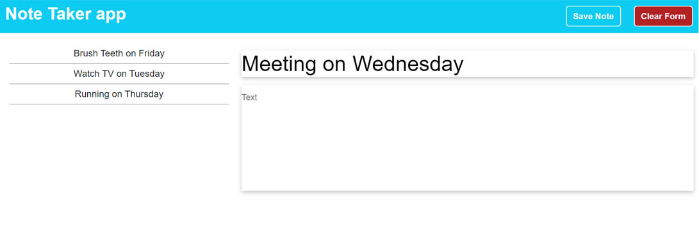

# Note Taker app

## Description

This project challenged me to use a server to deplay an app..

During this project I learned how to:

- setup a server with express.js.
- create a datbase with a json file.
- read and write to a json file.
- setup routes for a server.
- use input fields to get data from a user.
- hide and show html elements with eventlisteners.
- using fetch to get data.
- using the post request to send data.

## Link to website

https://woestyn101.github.io/myweather_app/

## Installation (N/A)

## Usage

This app provides an easy and accessible interface to get userinput and store that data in a json databse file.

## Screenshot of website

## Credits: Resources used

I used and modified code from the following resources:

https://www.youtube.com/watch?v=SccSCuHhOw0

https://www.youtube.com/watch?v=L72fhGm1tfE

https://www.youtube.com/watch?v=nH9E25nkk3I

https://www.youtube.com/watch?v=7KKNRU0RRjE

https://www.youtube.com/watch?v=1cjdlfB11Ss

https://developer.mozilla.org/en-US/docs/Web/API/Location/reload

## License

MIT
